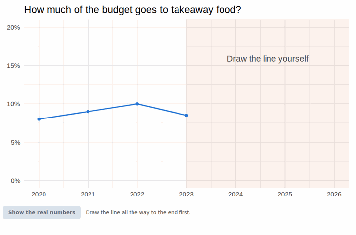

# ggyoudraw

'You draw it' charts for ggplot2: the reader finishes the line, then sees the
real numbers.



`geom_you_draw_line()` is a ggplot2 layer and `you_draw_it()` turns the plot
into an interactive widget, built on [ggiraph](https://davidgohel.github.io/ggiraph/).
ggplot2 draws the whole chart, so themes, scales, facets and other layers work
as usual.

## Installation

```r
# from the source tarball
install.packages("ggyoudraw_0.1.0.tar.gz", repos = NULL, type = "source")

# or from a clone of this repository
devtools::install()
```

## Example

```r
library(ggplot2)
library(ggyoudraw)

takeaway <- data.frame(
  year  = 2020:2026,
  share = c(8, 9, 10, 8.5, 10, 12, 15)
)

p <- ggplot(takeaway, aes(year, share)) +
  geom_you_draw_line(draw_from = 2023, colour = "#2a78d6") +
  scale_y_continuous(limits = c(0, 20))

you_draw_it(p, unit = "%")
```

`draw_from` is the last point the reader gets to see. The reader drags to draw
the rest, and a button reveals the real line.

The widget shows in the RStudio viewer, works in R Markdown and Quarto
documents with HTML output, and can be saved with `htmlwidgets::saveWidget()`.
Printed on an ordinary device, such as a PDF, `p` shows the complete line.

By default the layer leaves room above and below the data, so that the axis
does not give the answer away. Limits you set yourself win.

## Shiny

What the reader draws comes back as `input$<outputId>_guess`: a data frame
with the columns `panel`, `x`, `guess`, `truth` and `revealed`.

```r
library(shiny)

ui <- fluidPage(
  ggiraph::girafeOutput("chart"),
  tableOutput("guess")
)

server <- function(input, output) {
  output$chart <- ggiraph::renderGirafe(you_draw_it(p, unit = "%"))
  output$guess <- renderTable(input$chart_guess)
}

shinyApp(ui, server)
```

## Texts

The texts around the chart exist in English and Dutch. Replace any of them
with `labels`.

```r
you_draw_it(p, unit = "%", lang = "nl", decimal_mark = ",")
you_draw_it(p, labels = list(reveal = "Show me how I did"))

options(ggyoudraw.lang = "nl")   # Dutch for the whole session
```

## Reveal and controls

By default the reader clicks a button under the chart to see the real line.
Leave the button out with `auto_reveal = TRUE`: the real line then appears as
soon as the reader has drawn the whole line. Or move the controls above the
chart with `controls = "top"`. Once the line is complete, the button pulses
briefly so the reader notices it.

```r
you_draw_it(p, unit = "%", auto_reveal = TRUE)
you_draw_it(p, unit = "%", controls = "top")
```

## Fills

The layer can tint the part of the panel where the reader draws (`zone_fill`,
by default the colour of the reader's line) and the part with the known line
(`known_fill`, none by default). `fill_alpha` sets the opacity of both.

```r
geom_you_draw_line(draw_from = 2023, zone_fill = "orange",
                   known_fill = "grey50", fill_alpha = 0.1)
```

## Limitations

* One line per panel. Use facets to show several lines.
* Cartesian coordinates only: no `coord_flip()` or `coord_polar()`.
* Drawing needs a mouse or a touch screen. There is no keyboard alternative yet.

## How it works

1. `geom_you_draw_line()` draws the whole line. Through ggiraph's interactive
   grobs it tags the part after `draw_from` with its own SVG attributes, along
   with a table that maps each height in the panel to a value.
2. `you_draw_it()` renders the plot with `ggiraph::girafe()` and attaches
   `inst/assets/ggyoudraw.js`. That script hides the tagged part behind a clip
   path, turns the reader's drag into values with the table, and slides the
   clip path open on reveal.

## Development

```r
devtools::document()   # help pages and NAMESPACE
devtools::test()       # unit tests: what R writes into the SVG
devtools::check()
```

The unit tests cannot see what happens in the browser. `dev/browser-test.js`
covers that with [Playwright](https://playwright.dev): it draws, reveals and
resets in headless Chromium.

```sh
Rscript dev/browser-test.R && node dev/browser-test.js
```

Developed and tested with R 4.3.3, ggplot2 4.0.3 and ggiraph 0.9.7.

## Credits

The idea comes from The New York Times:
[You Draw It: What Got Better or Worse During Obama's Presidency](https://www.nytimes.com/interactive/2017/01/15/us/politics/you-draw-obama-legacy.html).
The technique of a clip path that slides open follows
[Adam Pearce's simplified version](https://bl.ocks.org/1wheel/07d9040c3422dac16bd5be741433ff1e)
and [Benoit Furic's you-draw-it-graph](https://github.com/BenoitFuric/you-draw-it-graph).
The widget is built on [ggiraph](https://davidgohel.github.io/ggiraph/) by David Gohel.
